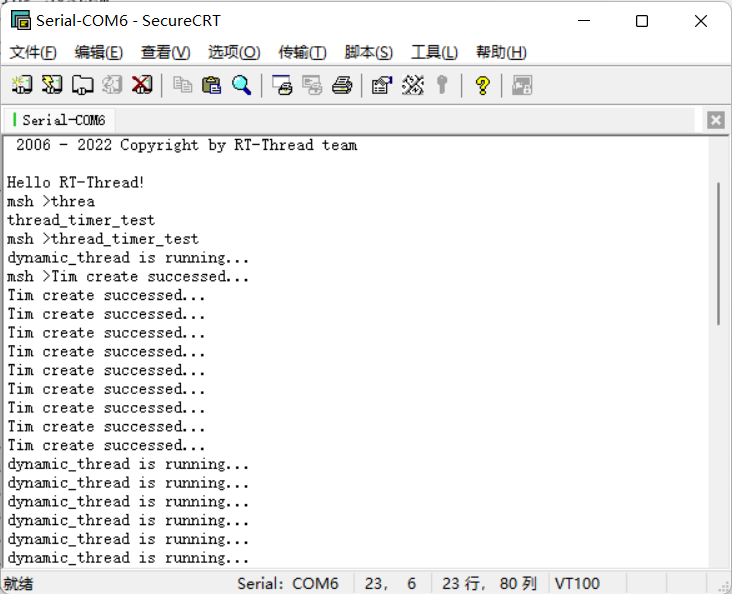
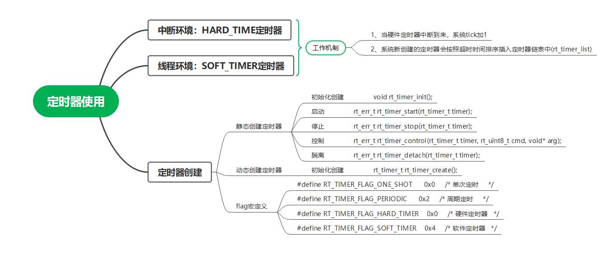
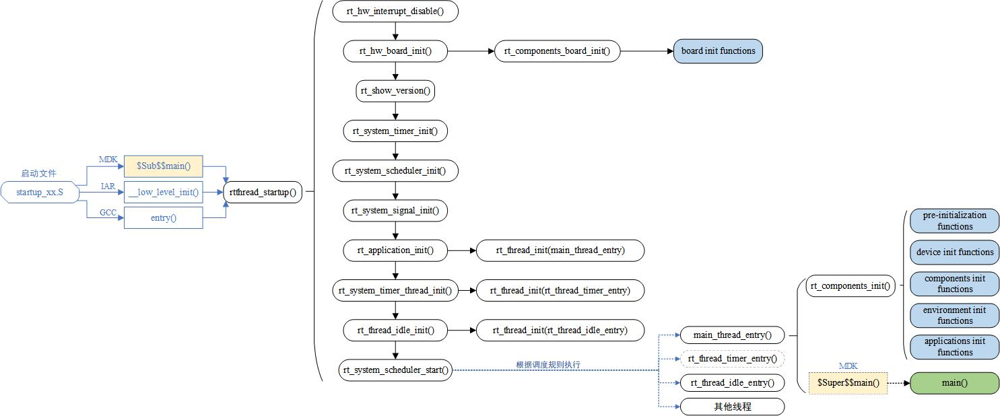

## 任务要求

---

1.创建一个线程，该线程中启动一个定时器。定时器回调中输出自己的信息。

2.静态线程/动态线程创建的函数调用关系图。

3.软/硬定时器调用关系图。

4.<可选> RT-Thread的启动顺序图，从上电到main函数启动。

5.今天的学习收获， 整理发送到Github仓库。


---

## 任务一：创建一个线程，该线程中启动一个定时器。定时器回调中输出自己的信息

#### 1、创建工程

代码段：

```c
/* static */
ALIGN(8) // 往下都按8字节对齐
static rt_timer_t Tim;
static int i = 0;

void thread_dynamic(void *parameter)
{
    while(1)
    {
        rt_kprintf("dynamic_thread is running...\n");
        rt_thread_mdelay(1000);
    }
}

void timeout(void *parameter)
{
    for(i;i<10;i++)
    {
        rt_kprintf("Tim create successed...\n");
    }
    rt_timer_stop(Tim);
}

void thread_timer_test(void)
{
    rt_thread_t dynamic_thread = RT_NULL;// 线程结构体指针：设置句柄

    /* create thread */
    dynamic_thread = rt_thread_create("dynamic", thread_dynamic, RT_NULL, 2048, 16, 5);
    Tim = rt_timer_create("Tim", timeout, RT_NULL, 10, RT_TIMER_FLAG_PERIODIC); // 时钟节拍为10，周期定时

    rt_thread_startup(dynamic_thread);

    if (Tim != RT_NULL)
    {
        rt_timer_start(Tim);
    }


}
MSH_CMD_EXPORT(thread_timer_test,dynamic thread / timer test sample);
```

#### 2、串口显示	



`分析：首先这里选择动态创建一个名为dynamic线程，并创建一个周期定时器，这里定时器的时间片设置为10，在串口端可以看到首先线程提示打印一遍，然后使用rt_thread_mdelay函数使得线程进入阻塞态，然后定时器获得资源并执行回调后函数，在10次循环后停止周期定时器。而后线程继续执行，并按每一秒阻塞一次打印信息。`

---

## 任务二：静态线程/动态线程创建的函数调用关系图


---

#### 任务三：软/硬定时器调用关系图



---

#### 任务四：RT-Thread的启动顺序图，从上电到main函数启动。（借鉴）


